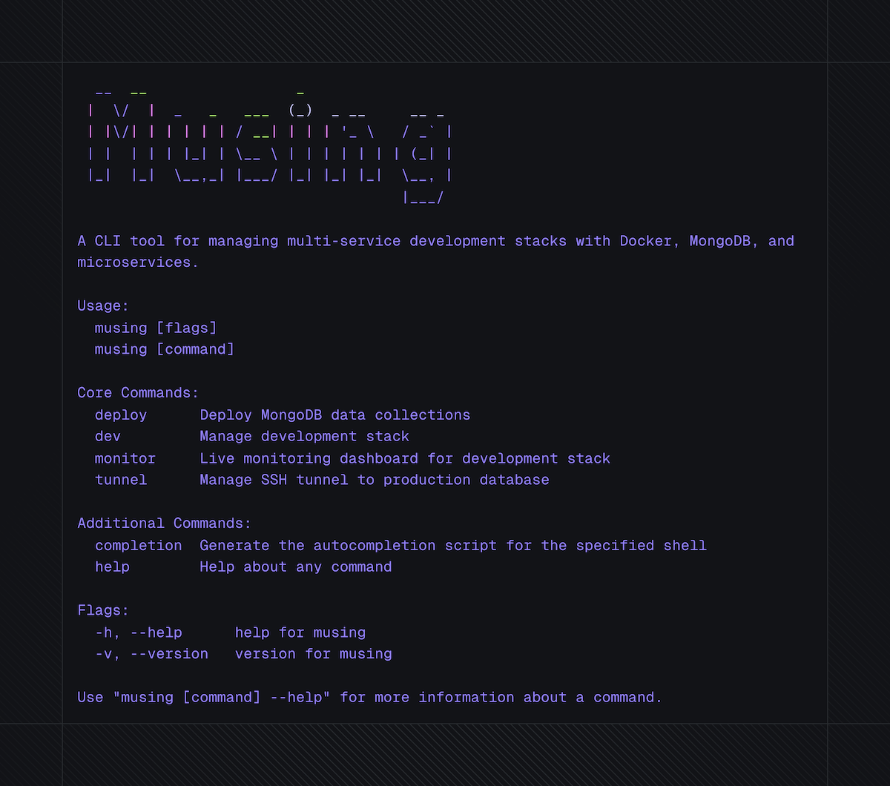
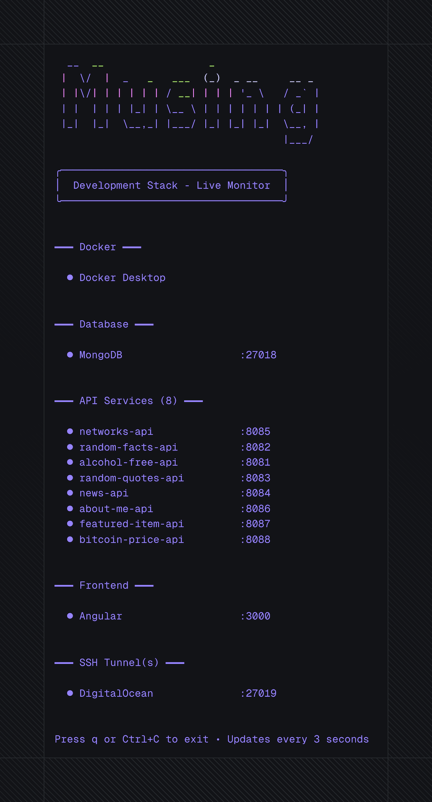

# Musing CLI

A fast command-line tool for managing multi-service development stacks with Docker, MongoDB, SSH tunnels, and port-based service health checks.

## What Does It Do?

This CLI provides professional tooling for complex development environments:

- **Live monitoring dashboard** - Real-time health checks for all services (3-second refresh)
- **Docker stack management** - Start/stop/rebuild services with auto-detection
- **Safe deployments** - MongoDB data sync with confirmations and tunnel verification
- **Beautiful TUI** - Professional terminal UI powered by Charm Bracelet

## My Workflow

This is my DevOps command center for [stevengregory.io](https://stevengregory.io). A tool managing my full-stack application: Angular frontend, Go service layer, and MongoDB database. Built for speedy local development and deployment of decoupled, multi-service stacks.

## Prerequisites

- Docker Desktop and Docker Compose (for `dev`, `monitor`, and logs)
- MongoDB Database Tools, including `mongoimport` (for `deploy`)
- SSH + `lsof` (for `tunnel`, `ssh`, and production deploys)
- `gum` (for styled non-TUI command output)

## Installation

### Homebrew

```bash
brew tap stevengregory/musing
brew install musing
```

Tap repository: `stevengregory/homebrew-musing`

**Upgrading:**

```bash
brew update && brew upgrade musing
```

## Commands

### monitor

Live dashboard with real-time health checks.

```bash
musing monitor
```

**Features:**

- Real-time service health monitoring (3-second refresh)
- Color-coded status indicators for each service
- Organized sections: Docker → Database → API Services → Frontend → SSH Tunnels
- Keyboard controls: `q`, `Ctrl+C`, or `Esc` to exit

### dev

Manage the development stack.

```bash
musing dev           # Start all services
musing dev start     # Start all services (explicit)
musing dev stop      # Stop all services
musing dev rebuild   # Rebuild images and start
musing dev logs      # Follow logs
```

**Features:**

- Auto-detects and starts Docker Desktop if needed
- Validates required repositories exist
- Health checks for database, API services, and frontend
- Progress indicators for long operations

### tunnel

Manage SSH tunnel to production database.

```bash
musing tunnel         # Start tunnel (or show status if running)
musing tunnel start   # Start tunnel explicitly
musing tunnel stop    # Stop tunnel
musing tunnel status  # Check tunnel status
```

**Features:**

- Auto-configures from `.musing.yaml` production settings
- Supports custom SSH key paths with ~ expansion
- Checks if tunnel is already running
- Automatically backgrounds SSH process
- Auto-managed by deploy command for production deployments

### ssh

Open an interactive SSH session to your production server.

```bash
musing ssh
```

**Features:**

- Auto-configures from `.musing.yaml` production settings
- Supports custom SSH key paths with ~ expansion
- Interactive shell session for debugging and administration

### deploy

Deploy MongoDB collections to dev or production.

```bash
musing deploy              # All collections to dev
musing deploy news         # Deploy collection or alias to dev
musing deploy news prod    # Deploy collection or alias to prod
```

**How it works:**

- Auto-discovers top-level `.json` files and immediate subdirectories containing `.json` files
- Collection names derive from filenames or directory names (e.g., `news.json` → `news`)
- Hyphenated source keys become underscored collection names (e.g., `blog-posts/` → `blog_posts`)
- API services can define short deploy aliases in `.musing.yaml`
- Automatically detects JSON arrays vs. objects in top-level files
- Treats every JSON file in a directory collection as one document and streams the documents to `mongoimport` in filename order
- Rejects ambiguous sources such as both `blog-posts.json` and `blog-posts/`, or source keys that resolve to the same MongoDB collection
- No hardcoded collection list required

Directory collections are useful when each document deserves isolated source history:

```text
data/
├── news.json
└── blog-posts/
    ├── first-post.json
    └── second-post.json
```

Each file under `blog-posts/` must contain exactly one JSON object. Like file-backed collections, the directory is a complete snapshot: deployment uses `--drop`, so removing a source file removes that document on the next deployment.

**Production safety:**

- Interactive confirmation required
- Auto-opens SSH tunnel if not already running
- Auto-closes tunnel after deployment completes
- Clear warnings about data overwrite

### version

Check the installed version.

```bash
musing version
musing --version
```

## Configuration

Create a `.musing.yaml` file alongside `compose.yaml` in your project root to define your stack. Commands search upward from the current directory until they find that project root.

```yaml
# Optional: directory containing API repos.
# Empty defaults to the project root's parent directory.
# Relative values resolve from the project root's parent; absolute and ~/ paths are supported.
apiReposDir: services

services:
  # Frontend
  - name: Angular
    port: 3000
    type: frontend

  # API Services
  - name: my-news-api
    port: 8080
    type: api
    alias: news # Optional: short key for `musing deploy news`
    collection: news-items # Optional: data file or directory key; defaults to alias when omitted

# Database configuration
database:
  type: MongoDB
  name: mydb
  devPort: 27018
  prodPort: 27019
  dataDir: data

# Optional: Production deployment settings
production:
  server: root@your-server.com # SSH server for production access
  remoteDBPort: 27017 # Remote database port (typically 27017 for MongoDB)
  sshKeyPath: ~/.ssh/your-key # Optional: specific SSH key to use (supports ~ expansion)
```

## Why This Approach?

**Project-agnostic design** means you can adapt it for any stack:

- Works with any frontend framework (Angular, React, Vue, etc.)
- Backend-agnostic (Go, Node, Python microservices)
- `.musing.yaml` driven service definitions
- Docker Compose integration
- Port-based health checking (framework-independent)
- MongoDB deployment patterns
- SSH tunnel support for remote databases

**Key benefits**:

- Fast startup (1-3ms)
- Type-safe Go prevents runtime errors
- Professional terminal UI with Bubble Tea
- Single Go binary; external tools are only needed for the stack operations that use them

## Development

```bash
# Run without installing
go run ./cmd/musing monitor
go run ./cmd/musing dev

# Test and build
go test ./...
make build

# Manage dependencies
go mod tidy

# Final whitespace check before committing
git diff --check
```

## Architecture

```
musing-cli/
├── cmd/
│   ├── musing/
│   │   └── main.go     # Entry point
│   ├── dev.go          # Dev command
│   ├── deploy.go       # Deploy command
│   ├── monitor.go      # Monitor command
│   ├── ssh.go          # SSH command
│   ├── tunnel.go       # Tunnel command
│   ├── project.go      # Shared project/config loading helpers
│   └── root.go         # Root command setup
├── internal/
│   ├── config/         # Service configs & ports
│   ├── docker/         # Docker operations
│   ├── health/         # Health checks
│   ├── mongo/          # MongoDB deployment
│   └── ui/             # Styled output & prompts
```

**Tech Stack**:

- Go (fast, type-safe, single binary)
- Cobra (command parsing)
- Bubble Tea, Bubbles, and bubble-table (interactive TUI)
- Lip Gloss (terminal styling)
- Huh (confirmation prompts)
- GoReleaser (release packaging)

See [AGENTS.md](AGENTS.md) for Codex guidance and [CLAUDE.md](CLAUDE.md) for additional project background.

## Screenshots

<details>
<summary>Help Command (click to expand)</summary>



</details>

<details>
<summary>Monitor Command (click to expand)</summary>



</details>

## License

MIT
